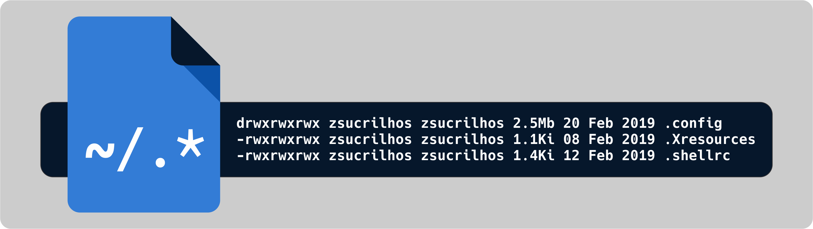

### My _i3-gaps/bspwm_ dotfiles
This is a repository dedicated to back-up and share my dotfiles when needed.

## Configuration:
| Type | Name |
| :--- | :--- |
| Linux Distribution | [Arch Linux](https://www.archlinux.org/) |
| Window Manager | [bspwm](https://github.com/baskerville/bspwm) |
| Bar | [polybar](https://github.com/jaagr/polybar) |
| Program Launcher | [rofi](https://github.com/DaveDavenport/rofi) |
| Music Player | [ncmpcpp](https://github.com/arybczak/ncmpcpp) with [MPD](https://github.com/MusicPlayerDaemon/MPD) |
| Music Player | [Clementine](https://www.clementine-player.org/pt_BR/) |
| Video Player | [mpv](https://github.com/mpv-player/mpv) |
| Video Player | [VLC](https://www.videolan.org/vlc/index.pt-BR.html) |
| Image Viewer | [sxiv](https://github.com/muennich/sxiv) |
| Image Viewer | [Viewnior](https://github.com/hellosiyan/Viewnior) |
| GUI File Manager | [Thunar](https://github.com/xfce-mirror/thunar) with [tumbler](https://github.com/xfce-mirror/tumbler) |
| GUI File Manager | [Caja](https://github.com/mate-desktop/caja) |
| Terminal File Manager | [ranger](https://github.com/ranger/ranger) with [icons](https://github.com/alexanderjeurissen/ranger_devicons) and [ueberzug](https://github.com/seebye/ueberzug) |
| Sound visualizer | [Cava](https://github.com/karlstav/cava) |
| PDF Viewer | [zathura](https://github.com/pwmt/zathura) |
| Wallpaper Setter | [feh](https://github.com/derf/feh) |
| Screen-shot Tool | [scrot](https://github.com/dreamer/scrot) and [i3scrot](https://github.com/pazuzu156/i3scrot) |
| Main Terminal | [termite](https://github.com/thestinger/termite) |
| Terminal 2 (Fallback) | [alacritty](https://github.com/jwilm/alacritty) |
| Terminal 3 (Fallback) | [xst](https://github.com/gnotclub/xst) |
| Shell | zsh with [oh-my-zsh](https://github.com/robbyrussell/oh-my-zsh) ([ponctual theme](https://github.com/dannynimmo/punctual-zsh-theme)) |
| zsh Plugins | [zsh-autocompletions](https://github.com/zsh-users/zsh-autosuggestions), [zsh-autosuggestions](https://github.com/zsh-users/zsh-completions) |
| Terminal General Search Tool | [fzf](https://github.com/junegunn/fzf) |
| Terminal Multiplexer | [tmux](https://github.com/tmux/tmux) with [oh-my-tmux](https://github.com/gpakosz/.tmux) |
| Main Code Editor | [neovim](https://neovim.io/) ([rc](https://github.com/zSucrilhos/dotfiles/blob/master/Desktop/.config/nvim/init.vim) |
| Lockscreen | [betterlockscreen](https://github.com/pavanjadhaw/betterlockscreen) |
| Notification daemon | [Dunst](https://github.com/dunst-project/dunst) |
| GTK+ Theme | My forked version of [Juno](https://github.com/EliverLara/Juno)-Ocean theme by [EliverLara](https://github.com/EliverLara): [Juno-Ocean-Sucrilhos](Link goes here) |

### Polybar:
Top bar:
* Scratchpad indicator (/scripts/i3-scratchpad-indicator.py)
* WS indicator
* MPD Module
* METAR (weather-report (AUR)), Wi-Fi/DSL, Wi-Fi strenght, Traffic indicator, date, powermenu
