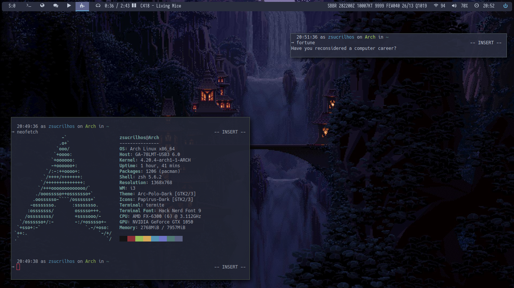

### My _i3-gaps/bspwm_ dotfiles
This is a repository dedicated to back-up and share my dotfiles when needed.
Layout inspired by [SeraphyBR](https://github.com/SeraphyBR/DotFiles)

## Overall View:
| Program | Name |
| :--- | :--- |
| Linux Distribution | [Arch Linux](https://www.archlinux.org/) |
| Window Manager | [bspwm](https://github.com/baskerville/bspwm)/[i3-gaps](https://github.com/Airblader/i3) |
| Bar | [polybar](https://github.com/jaagr/polybar) |
| Program Launcher | [rofi](https://github.com/DaveDavenport/rofi) |
| Web Broser | [firefox](https://www.mozilla.org/en-CA/firefox/new/) and [qutebrowser](https://github.com/qutebrowser/qutebrowser) |
| Music Player 1 | [ncmpcpp](https://github.com/arybczak/ncmpcpp) with [MPD](https://github.com/MusicPlayerDaemon/MPD) |
| Music Player 2 (Fallback) | [Clementine](https://www.clementine-player.org/pt_BR/) |
| Video Player 1 | [mpv](https://github.com/mpv-player/mpv) |
| Video Player 2 (Fallback) | [VLC](https://www.videolan.org/vlc/index.pt-BR.html) |
| Image Viewer 1 | [sxiv](https://github.com/muennich/sxiv) |
| Image Viewer 2 (Fallback) | [Viewnior](https://github.com/hellosiyan/Viewnior) |
| GUI File Manager 1 | [Thunar](https://github.com/xfce-mirror/thunar) with [tumbler](https://github.com/xfce-mirror/tumbler) |
| GUI File Manager 2 (Fallback) | [Caja](https://github.com/mate-desktop/caja) |
| Terminal File Manager | [ranger](https://github.com/ranger/ranger) with [devicons](https://github.com/alexanderjeurissen/ranger_devicons) and [ueberzug](https://github.com/seebye/ueberzug) |
| Sound visualizer | [Cava](https://github.com/karlstav/cava) |
| PDF Viewer | [zathura](https://github.com/pwmt/zathura) |
| Text Reader (RSVP) | [fltrdr](https://octobanana.com/software/fltrdr) |
| Wallpaper Setter | [feh](https://github.com/derf/feh) |
| Screen-shot Tool | [scrot](https://github.com/dreamer/scrot) and [i3scrot](https://github.com/pazuzu156/i3scrot) |
| Main Terminal | [termite](https://github.com/thestinger/termite) |
| Terminal 2 (Fallback) | [alacritty](https://github.com/jwilm/alacritty) |
| Terminal 3 (Fallback) | [xst](https://github.com/gnotclub/xst) |
| Shell | zsh with [oh-my-zsh](https://github.com/robbyrussell/oh-my-zsh) ([ponctual theme](https://github.com/dannynimmo/punctual-zsh-theme)) |
| zsh Plugins | [zsh-autocompletions](https://github.com/zsh-users/zsh-autosuggestions), [zsh-autosuggestions](https://github.com/zsh-users/zsh-completions), [k](https://github.com/supercrabtree/k), [alias-tips](https://github.com/djui/alias-tips), [git](https://github.com/robbyrussell/oh-my-zsh/tree/master/plugins/git) and [vi-mode](https://github.com/robbyrussell/oh-my-zsh/tree/master/plugins/vi-mode) |
| Terminal General Search Tool | [fzf](https://github.com/junegunn/fzf) |
| Terminal Multiplexer | [tmux](https://github.com/tmux/tmux) with [oh-my-tmux](https://github.com/gpakosz/.tmux) |
| GUI Calculator App | [speedcruch](https://speedcrunch.org/) with [my palenight-inspired theme]()
| Main Code Editor | [neovim](https://neovim.io/) ([init.vim](https://github.com/zSucrilhos/dotfiles/blob/master/Desktop/.config/nvim/init.vim)) |
| Lockscreen | [betterlockscreen](https://github.com/pavanjadhaw/betterlockscreen) |
| Notification daemon | [Dunst](https://github.com/dunst-project/dunst) |
| GTK+ Theme | [My slightly modified version](http://link-goes-here.com) of [Juno](https://github.com/EliverLara/Juno)-Ocean theme by [EliverLara](https://github.com/EliverLara)|

## Screenshots:

