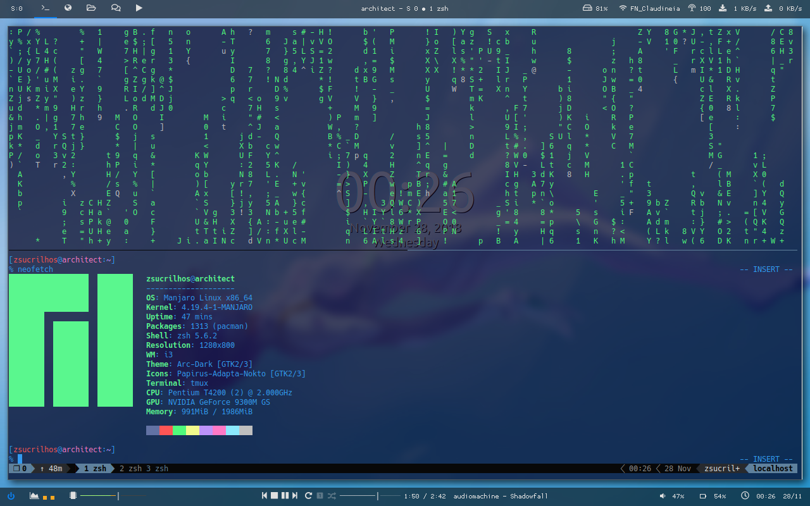

# My _i3-gaps_ dotfiles

## Configuration:
### Shell:
* zsh (zsh-autocompletions, zsh-autosuggestions)
* oh-my-zsh - https://github.com/robbyrussell/oh-my-zsh (theme: kphoen)
* fzf - https://github.com/junegunn/fzf
* antigen (https://github.com/zsh-users/antigen)
* tmux
* oh-my-tmux (https://github.com/gpakosz/.tmux)

### Polybar:
Top bar
* Scratchpad indicator (/scripts/i3-scratchpad-indicator.py)
* WS indicator
* Window Name
* Disk, Wi-Fi/DSL net indicator, Wi-Fi strenght and traffic

Bottom bar
* Power menu
* CPU and Memory usage
* mpd module
* pulseaudio, battery and clock/date modules

### Neovim (VimPlug):

* 'terryma/vim-multiple-cursors'

* 'ncm2/ncm2'
* 'roxma/nvim-yarp'
* 'ncm2/ncm2-bufword'
* 'ncm2/ncm2-tmux'
* 'ncm2/ncm2-path'
* 'jiangmiao/auto-pairs'

* 'ncm2/ncm2-jedi'

* 'ncm2/ncm2-pyclang'

* 'nathanaelkane/vim-indent-guides'

* 'scrooloose/nerdtree'
* 'vim-syntastic/syntastic'
* 'itchyny/lightline.vim'

* 'yuttie/hydrangea-vim'
* 'arcticicestudio/nord-vim'

* 'scrooloose/nerdcommenter'
* 'tpope/vim-repeat'
* 'svermeulen/vim-easyclip'
* 'sheerun/vim-polyglot'
* 'wellle/tmux-complete.vim'

* 'airblade/vim-gitgutter'

